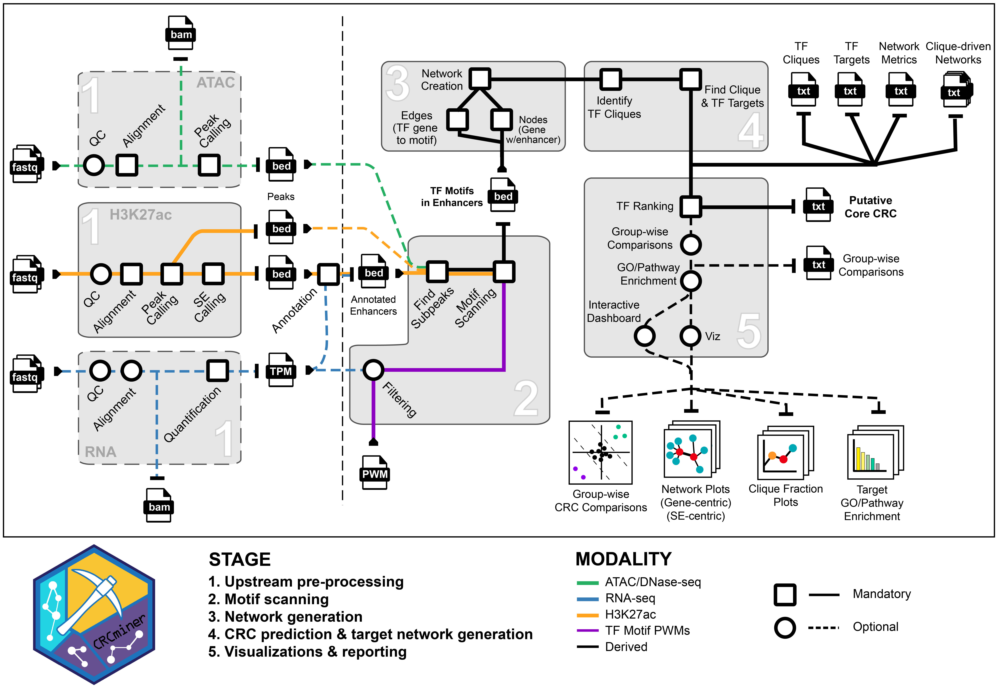

<p align="center" width="100%">
    
</p>

---

Core regulatory circuitries (AKA CRCs) are dense networks of self-regulating transcription factors responsible for driving and maintaining cell state.
Members of CRCs are typically regulated by super enhancers.
**CRCminer** is designed to identify such CRCs and provide utilities to compare and visualize them.

This project was conceptualized for and initially developed during the [St. Jude Children's Research Hospital KIDS23 BioHackathon](https://github.com/stjude-biohackathon) by:
- Jared Andrews (team lead)
- Achisha Saikia
- Srinidhi Varadharajan 
- Sridhar N
- Pandurang Kolekar
- Vidhya Jagannathan

It even snagged a prize for "Most Technically Impressive" project.

## Workflow

<p align="center" width="100%">
    
</p>

## Install

This package is under active development and may break at any time.
It is not yet recommended for production use.

```
pip install git+https://github.com/j-andrews7/CRCminer.git
```

## Usage

```
CRCminer [command] 
```

Commands:  
 - `mine` - Identifies putative CRC members from a set of enhancer regions.
 - `compare`  - Compare two networks as returned with `mine`.
 - `report` - Launch an interactive dashboard for viewing `mine` and `compare` results.

---

`CRCminer mine` command options:     

Identifies putative CRC members in a given sample.

 - `--fasta PATH ` - Genome FASTA file.   
 - `--enhancer PATH` - Path to annotated (super)enhancer file, as output by ROSE.
 - `--subpeaks PATH` - Path to BED file of subpeaks to scan for motifs. Will be limited to those within enhancer regions.
 - `--mapping PATH` - Motif ID to gene ID mapping file.
 - `--active PATH` - File containing active or expressed genes, one per line. 
    Genes not found in this list will be excluded from the networks and motif scanning.
 - `--threshold FLOAT` - p-value threshold for determining significant motif matches.
 - `--help` - Show this message and exit.

---

`CRCminer compare` command options:

 - `--sample1 PATH` - CRCminer `mine` output directory from a sample.
 - `--sample2 PATH` - CRCminer `mine` output directory from a sample.

---

`CRCminer report` command options:

 - `--indir PATH(s)` - Paths to one or more input directory containing CRCminer results.


## References

CRCminer is heavily inspired by [coltron](https://pypi.org/project/coltron/).